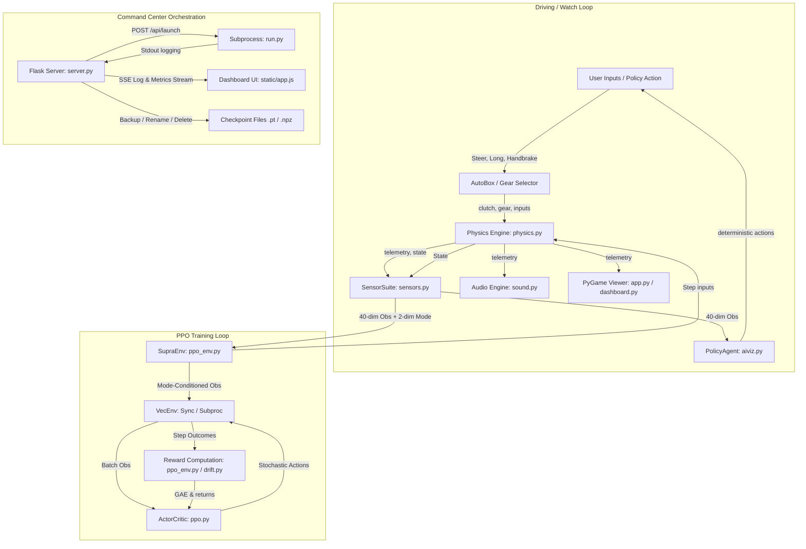

# Supra Drift: Technical Deep Dive & Architectural Analysis

Welcome to the comprehensive technical walkthrough of the **Supra Drift** simulator. This document provides a module-by-module analysis, documents the end-to-end data flows, explains the mathematical formulations of the physics and learning pipelines, and concludes with actionable recommendations for future development.

---

## Table of Contents
1. [Module-by-Module Technical Analysis](#1-module-by-module-technical-analysis)
2. [Data Flow and Architecture](#2-data-flow-and-architecture)
3. [Mathematical & Algorithmic Formulations](#3-mathematical--algorithmic-formulations)
   - [Combined-Slip Pacejka Tyre Model](#combined-slip-pacejka-tyre-model)
   - [Tyre Relaxation Length (Slip Lag)](#tyre-relaxation-length-slip-lag)
   - [Suspension Weight Transfer](#suspension-weight-transfer)
   - [Drivetrain and sequential twin-turbo spool](#drivetrain-and-sequential-twin-turbo-spool)
   - [PPO Reinforcement Learning & GAE](#ppo-reinforcement-learning--gae)
   - [Drift Scoring and Anti-Spin Shaping](#drift-scoring-and-anti-spin-shaping)
   - [Audio Synthesis Pipeline](#audio-synthesis-pipeline)
4. [Actionable Findings and Recommendations](#4-actionable-findings-and-recommendations)

---

## 1. Module-by-Module Technical Analysis

The project contains a clean separation of concerns across configuration, physics, sensors, learning, rendering, and dashboard orchestration.

### 1.1 `supra/config.py`
* **Role**: Centralized parameter definition. Contains dataclasses for all simulator dimensions (tyre shapes, powertrain curves, reward coefficients, PPO parameters).
* **Key Components**:
  - `Pacejka`: Holds shape coefficients ($B, C, E$) for the Magic Formula.
  - `CarSpec`: Mass, wheelbase, inertia, powertrain specifications, torque curves, and gear ratios.
  - Presets: `supra()`, `rx7()`, and `skyline()` configure different weight, torque, and drivetrain characteristics.
  - `SimSpec`, `SensorSpec`, `EvoSpec`, `PPOSpec`, `DriftReward`, `RaceReward`, `HybridReward`.
* **API**: `get_car(name)` returning a `CarSpec` instance.
* **Connections**: Imported by almost every other file to configure behavior.

### 1.2 `supra/physics.py`
* **Role**: Coordinates the 4-wheel vehicle dynamics simulator.
* **Key Components**:
  - `Controls`: Dataclass holding normalized user/agent inputs.
  - `Vehicle`: Manages state ($x, y, \psi, v_x, v_y, r, \omega_{\text{wheel}}, \omega_{\text{engine}}$, boost, loads) and integrates equations of motion at 120 Hz.
  - `_pacejka(...)`: Computes the base normalized tyre force curve.
* **API**: `Vehicle.reset(...)`, `Vehicle.step(controls, dt)`, and `Vehicle.telemetry()`.
* **Connections**: Reads specs from `config.py`; driven by `CarAgent` (GA), `SupraEnv` (PPO), or manual controls in `app.py`.

### 1.3 `supra/track.py`
* **Role**: Procedural circuit generation and geometric queries.
* **Key Components**:
  - `Track`: Densely samples centripetal Catmull-Rom splines to compute left/right track walls, tangents, left normals, arc lengths, and curvature.
  - `make_track(difficulty, style, length, seed)`: Generates random circuits based on four archetypes (`gp`, `technical`, `speedway`, `touge`).
  - `named_track(name)`: Returns fixed circuits (e.g., `akina`, `pass`, `sprint`) seeded with stable CRC32 hash seeds.
* **API**: `Track.nearest(x, y)`, `Track.frame(x, y)` (returns progress, lateral deviation, local curvature), `Track.raycast(...)` (vectorized raycast walls), and `Track.lookahead_curvature(...)`.
* **Connections**: Queried by `sensors.py` and `app.py`. Used as the environment boundary in `ppo_env.py` and `agent.py`.

### 1.4 `supra/sensors.py`
* **Role**: Normalizes raw simulator observations into inputs suitable for neural networks.
* **Key Components**:
  - `Observation`: Container for normalized state vector, raw beam measurements, and proprioception labels.
  - `SensorSuite`: Builds a 40-dimensional vector consisting of 9 normalized raycast distance beams, 25 proprioceptive values (velocities, slips, load, grip, engine status), and 6 curvature look-ahead points.
* **API**: `SensorSuite.observe(vehicle, track)` returning an `Observation`.
* **Connections**: Connects the `Vehicle` and `Track` to the learning policies (`brain.py`, `ppo_env.py`).

### 1.5 `supra/brain.py` & `supra/evolution.py` & `supra/agent.py`
* **Role**: Implement the Genetic Algorithm (GA) path.
* **Key Components**:
  - `MLP` (`brain.py`): Multi-layer perceptron implemented in pure NumPy. Maps 40 normalized observations to 3 outputs (steering, throttle, brake). Seeding of output bias guarantees forward movement at generation 0.
  - `GA` (`evolution.py`): Orchestrates elite-fraction selection, tournament selection, uniform crossover, and Gaussian mutation.
  - `CarAgent` (`agent.py`): Wraps a single car + brain. Determines when an episode terminates (crash, stall, no-progress, driving backwards) and computes fitness.
* **API**: `GA.advance(fitnesses)`, `GA.evaluate_headless(genomes)`, `CarAgent.run()`.
* **Connections**: Driven by `run.py` or `app_ga.py`.

### 1.6 `supra/ppo.py` & `supra/ppo_env.py`
* **Role**: Implement the PyTorch Reinforcement Learning path.
* **Key Components**:
  - `ActorCritic` (`ppo.py`): Actor network outputting Gaussian means and critic network predicting values.
  - `PPO` (`ppo.py`): Implements GAE calculation, clipping, learning rate/entropy scheduling, and deterministic evaluation.
  - `SupraEnv` (`ppo_env.py`): A Gym-like wrapper that appends mode-conditioning ([race, drift] one-hot) to the observation vector, manages rewards, and triggers resets.
  - `SyncVecEnv` / `SubprocVecEnv`: Run multiple environments in-process or across worker subprocesses.
* **API**: `PPO.train()`, `PPO.collect()`, `PPO.update()`, `PPO.save()`, `PPO.load_state()`.
* **Connections**: Leverages `drift.py` for reward calculation; driven by `run.py` or `app_ppo.py`.

### 1.7 `supra/drift.py`
* **Role**: Computes the complex reward functions for the drift policy.
* **Key Components**:
  - `DriftScorer`: Stateful scorer tracking drift combos, transitions, and steady slide durations.
* **API**: `DriftScorer.step(vehicle, track_frame, half_width, dt)`.
* **Connections**: Instantiated by `SupraEnv` to compute step rewards in drift mode.

### 1.8 `supra/sound.py`
* **Role**: Real-time additive audio synthesis.
* **Key Components**:
  - `EngineAudio`: Synthesizes engine cylinder harmonics, turbo whine, blow-off valve compressor surge (with high-boost crack and pitch sweeps), tyre squeal, and exhaust crackle.
* **API**: `EngineAudio.start()`, `EngineAudio.update(vehicle, throttle)`, `EngineAudio.reset()`, and `EngineAudio.stop()`.
* **Connections**: Runs in a background thread via `sounddevice`; updated by the main loop in `app.py`.

### 1.9 `supra/app.py` & `supra/app_ga.py` & `supra/app_ppo.py`
* **Role**: PyGame applications for driving, watching, and monitoring.
* **Key Components**:
  - `app.py`: Standard cockpit viewer containing camera motion, visual effects, and inputs.
  - `app_ga.py` / `app_ppo.py`: Live training visualization overlays.
* **Connections**: Dispatched by `run.py`.

### 1.10 `supra/carart.py` & `supra/fx.py` & `supra/dashboard.py` & `supra/aiviz.py`
* **Role**: Visual presentation layer (procedural car drawing, particle systems, HUD rendering, and policy confidence visualizer).
* **Connections**: Imported by the PyGame app wrappers.

---

## 2. Data Flow and Architecture

The following diagram outlines the system execution loop and how data flows between components across the drive and train loops:



### 2.1 The Observation & Normalization Pipeline
1. **Raw Observation**: `SensorSuite.observe()` reads the vehicle's position relative to the track centerline and fires 9 raycasts.
2. **Concatenation**: Composes a 40-dimensional raw float array: `[beams (9), proprioception (25), look-ahead curvature (6)]`.
3. **Normalization**: The first 40 dimensions are passed through Welford's running normalization:
   $$z = \text{clip}\left(\frac{x - \mu}{\sqrt{\sigma^2 + \epsilon}}, -5.0, 5.0\right)$$
4. **Mode Conditioning**: The environment appends a 2-dimensional one-hot vector indicating the target style (e.g., `[1.0, 0.0]` for race, `[0.0, 1.0]` for drift, `[1.0, 1.0]` for hybrid).
5. **Policy Input**: The resulting 42-dimensional vector is passed to the network.

### 2.2 Checkpoint Save & Load Cycle
* Checkpoint saves are performed **atomically**. The state dictionary is serialized to a `.tmp` file using `torch.save` (for PPO) or `np.savez` (for GA). Once writing is complete, `os.replace()` atomically moves the temporary file over the target checkpoint slot (e.g., `ppo_drift.pt`). This guarantees that concurrent processes reading checkpoints for watching (`run.py --watch-drift`) never encounter corrupted half-written files.

---

## 3. Mathematical & Algorithmic Formulations

The simulator's high fidelity relies on implementing verified vehicle dynamics and reinforcement learning equations directly in code.

### 3.1 Combined-Slip Pacejka Tyre Model
Instead of treating lateral and longitudinal tyre forces independently, they are combined using a friction ellipse.

1. **Normalized Slip**: First, pure slip ratio $\kappa$ and slip angle $\alpha$ are passed to the base Pacejka Magic Formula:
   $$F_{x0} = D_x \cdot \sin\left(C_x \cdot \arctan\left(B_x \kappa - E_x(B_x \kappa - \arctan(B_x \kappa))\right)\right)$$
   $$F_{y0} = -D_y \cdot \sin\left(C_y \cdot \arctan\left(B_y \tan\alpha - E_y(B_y \tan\alpha - \arctan(B_y \tan\alpha))\right)\right)$$
   Where $D$ is the maximum friction capability of the tyre: $D = \mu \cdot F_z$.

2. **Friction Ellipse Coupling**:
   $$\text{total} = \sqrt{F_{x0}^2 + F_{y0}^2}$$
   $$\text{scale} = \begin{cases} 
      \frac{\mu F_z}{\text{total}} & \text{if } \text{total} > \mu F_z \\
      1.0 & \text{otherwise}
   \end{cases}$$
   $$F_x = F_{x0} \cdot \text{scale}$$
   $$F_y = Fy0 \cdot \text{scale}$$

This formulation enforces a shared grip budget: throttle-on wheelspin increases longitudinal force demand $F_{x0}$, which scales down lateral force capability $F_y$, causing the rear wheels to lose lateral grip and simulate throttle-on oversteer.

### 3.2 Tyre Relaxation Length (Slip Lag)
Tyre forces do not build up instantaneously. The contact patch behaves like a spring-damper system, modeled using a first-order lag over a distance (relaxation length):

$$\tau_{\text{lat}} = \frac{L_{\text{relaxation\_lat}}}{\max(|v_{\text{long}}|, v_{\text{floor}})}$$
$$\alpha_{\text{lag}} \leftarrow \alpha_{\text{lag}} + \frac{dt}{\tau_{\text{lat}} + dt} \left(\alpha_{\text{inst}} - \alpha_{\text{lag}}\right)$$

Where $L_{\text{relaxation\_lat}}$ is configured to $0.55\text{ m}$ for the lateral dynamics. This avoids instantaneous spikes in tyre forces and gives transitions a smooth, weighted feel.

### 3.3 Suspension Weight Transfer
Lateral and longitudinal accelerations shift load ($F_z$) between the tyres. The vertical forces are integrated through a suspension lag to simulate body roll:

$$\Delta F_{z, \text{long}} = \frac{m \cdot a_x \cdot h_{\text{cg}}}{L_{\text{wheelbase}}}$$
$$\Delta F_{z, \text{lat, front}} = \frac{m \cdot a_y \cdot h_{\text{cg}}}{W_{\text{track}}} \cdot K_{\text{roll\_front}}$$
$$\Delta F_{z, \text{lat, rear}} = \frac{m \cdot a_y \cdot h_{\text{cg}}}{W_{\text{track}}} \cdot (1.0 - K_{\text{roll\_front}})$$

Where $K_{\text{roll\_front}}$ (roll stiffness distribution) is $0.52$. Total target loads on the wheels are:
$$F_{z, \text{FL\_target}} = F_{z, \text{static\_front}} - \frac{\Delta F_{z, \text{long}}}{2} - \Delta F_{z, \text{lat, front}} + \frac{F_{\text{downforce, front}}}{2}$$
These targets are smoothed using first-order lag filtering:
$$F_z \leftarrow F_z + \frac{dt}{\tau_{\text{suspension}} + dt} \left(F_{z, \text{target}} - F_z\right)$$

### 3.4 Drivetrain and sequential twin-turbo spool
The engine torque is computed by interpolating a static torque curve at the current engine RPM and scaling by sequential turbo boost:
$$T_e = T_{\text{base}}(\text{rpm}) \cdot \text{throttle} \cdot \left(\text{boost\_floor} + (1.0 - \text{boost\_floor}) \cdot \text{boost}\right) - T_{\text{friction}}(\text{rpm})$$
Turbo spool is simulated as a lagging system:
$$\tau_{\text{spool}} = \begin{cases} \tau_{\text{spool\_up}} & \text{if } \text{target\_boost} > \text{boost} \\ \tau_{\text{spool\_down}} & \text{otherwise} \end{cases}$$
$$\text{boost} \leftarrow \text{boost} + \frac{dt}{\tau_{\text{spool}} + dt} (\text{target\_boost} - \text{boost})$$

The clutch torque is modeled using a hyperbolic tangent to smooth engagement transitions:
$$T_c = \text{clutch} \cdot C_{\text{clutch\_capacity}} \cdot \tanh\left(\frac{\omega_{\text{engine}} - \omega_{\text{driveshaft}}}{\omega_{\text{clutch\_slip\_ref}}}\right)$$

### 3.5 PPO Reinforcement Learning & GAE
The surrogate objective optimized is standard PPO:
$$L^{\text{CLIP}}(\theta) = \hat{\mathbb{E}}_t \left[ \min\left(r_t(\theta)\hat{A}_t, \text{clip}(r_t(\theta), 1-\epsilon, 1+\epsilon)\hat{A}_t\right) \right]$$
Where the advantage $\hat{A}_t$ is computed using Generalized Advantage Estimation (GAE):
$$\delta_t^V = r_t + \gamma V(s_{t+1}) - V(s_t)$$
$$\hat{A}_t = \sum_{l=0}^{\infty} (\gamma \lambda)^l \delta_{t+l}^V$$
If an episode is truncated (reaches the time limit `episode_seconds`), the environment bootstraps the final step using the critic value function:
$$r_{\text{bootstrap}} = r_t + \gamma V(s_{\text{terminal}})$$
This bootstrap is omitted if the episode terminates due to a crash, which anchors the value target of crashed states to the terminal penalty.

### 3.6 Drift Scoring and Anti-Spin Shaping
The step reward in drift mode consists of centerline progress, speed, and slide scoring:
$$\text{Reward} = \left(\text{speed} \cdot |\sin(\theta_{\text{slip}})| \cdot C_{\text{angle}} \cdot W_{\text{rot}} \cdot W_{\text{spin}}\right) \cdot W_{\text{soft}} \cdot W_{\text{speed}} \cdot \text{sustain} + \text{progress} \cdot \Delta_{\text{lap}} + C_{\text{hold}}$$

* **Soft Entry ($W_{\text{soft}}$)**: Cubic smoothstep filtering out small slides:
  $$s = \text{clip}\left(\frac{\theta_{\text{slip}} - \theta_{\text{entry\_lo}}}{\theta_{\text{entry\_hi}} - \theta_{\text{entry\_lo}}}, 0, 1\right), \quad W_{\text{soft}} = s^2(3 - 2s)$$
* **Over-Rotation Falloff ($W_{\text{rot}}$)**: Linear falloff when slip exceeds $55^{\circ}$:
  $$W_{\text{rot}} = \max\left(0, 1 - \frac{\theta_{\text{slip}} - \theta_{\text{peak}}}{\theta_{\text{spin}} - \theta_{\text{peak}}}\right)$$
* **Anti-Spin Gate ($W_{\text{spin}}$)**: Suppresses reward if the yaw rate ($r$) is too high, indicating a spin-out:
  $$W_{\text{spin}} = \max\left(0, 1 - \frac{|r| - r_{\text{spin\_rate}}}{r_{\text{span}}}\right)$$
* **Steady-Hold Bonus ($C_{\text{hold}}$)**: Added if the slip angle is changing slowly ($|d\theta_{\text{slip}}/dt| < 35^{\circ}/\text{s}$), rewarding sustained slides instead of wild snaps.

### 3.7 Audio Synthesis Pipeline
All sounds are synthesized in real-time in a single background callback.
* **Engine**: Formed as an additive series of crank frequency $f_0 = \text{rpm} / 60$:
  $$x_{\text{engine}}(t) = \sum_{i} A_i \cdot \sin\left(\text{order}_i \cdot 2\pi f_0 t\right)$$
  The raw wave is distorted with $\tanh(x_{\text{engine}} \cdot \text{drive})$ to simulate induction rasp.
* **Turbo Whine**: Sine wave driven by spool boost:
  $$x_{\text{turbo}}(t) = 0.14 \cdot \text{boost}^{1.5} \cdot \sin(2\pi f_{\text{turbo}} t) \cdot \left(1 + 0.5 \cdot \text{boost} \cdot \sin(2\pi \cdot 58 t)\right)$$
* **Blow-off Valve (BOV)**: Triggers a state machine upon throttle lift-off:
  $$x_{\text{bov}}(t) = \left(K_{\text{tone}} \cdot \text{body}(t) + K_{\text{noise}} \cdot \text{noise\_bright}(t)\right) \cdot \text{pulse}(t) \cdot e^{-t/\tau_{\text{decay}}}$$
  Where $\text{pulse}(t)$ is an LFO pulse train representing compressor surge flutter, and $\tau_{\text{decay}}$ scales with the boost level at release.

---

## 4. Actionable Findings and Recommendations

Based on a deep-dive review of the source files, here are 5 concrete recommendations prioritized by complexity and performance impact.

### Recommendation 1: Fix High-Frequency Memory Allocation in Render Loop
* **Location**: [supra/app.py:L450](file:///Users/REVIEW_USER/Desktop/Supra%20Ai%202/supra/app.py#L450)
* **Finding**: The function `_draw_streaks` instantiates a new NumPy random generator object `np.random.default_rng(...)` every frame while the vehicle speed is above 22 m/s. Allocating objects inside a 60 Hz rendering loop causes significant overhead and triggers frequent garbage collection cycles, resulting in frame stuttering.
* **Fix**: Instantiate a single `self.rng = np.random.default_rng(seed)` generator in the initialization block of `app.py` or use python's fast built-in `random` module, rather than recreating a generator every frame.

### Recommendation 2: Bound PPO Actor Output to Prevent Clipping-Gradient Death
* **Location**: [supra/ppo.py:L50-L53](file:///Users/REVIEW_USER/Desktop/Supra%20Ai%202/supra/ppo.py#L50-L53)
* **Finding**: The actor network outputs the mean action via a raw linear layer without bounding. The training environment clips these actions to $[-1.0, 1.0]$. If the network outputs values far outside the bounds (e.g. $+8.0$), clipping them inside the environment means small network adjustments produce zero change in the executed action. This causes flat gradients (gradient death) and slows down convergence.
* **Fix**: Apply a `nn.Tanh()` activation to the actor's mean action output inside the network, ensuring the policy output naturally aligns with the environment's control constraints.

### Recommendation 3: Add Count Capping to Welford's `RunningNorm`
* **Location**: [supra/ppo_env.py:L39-L48](file:///Users/REVIEW_USER/Desktop/Supra%20Ai%202/supra/ppo_env.py#L39-L48)
* **Finding**: The running normalizer updates using Welford's algorithm, letting `self.count` accumulate indefinitely. Over long training runs (e.g., millions of steps), `self.count` becomes so large that new training steps have no mathematical effect on updating the mean and variance. If the state distribution changes later in training (e.g., when transitioning from race to hybrid, or when entering tighter turns), the normalizer cannot adapt.
* **Fix**: Cap `self.count` to a maximum ceiling (e.g. `self.count = min(self.count, 1e6)`) or implement an exponential moving average (EMA) decay factor to keep the normalization window responsive.

### Recommendation 4: Optimize Mute Logic to Bypass Audio Synthesis Math
* **Location**: [supra/sound.py:L299-L302](file:///Users/REVIEW_USER/Desktop/Supra%20Ai%202/supra/sound.py#L299-L302)
* **Finding**: When muting the audio, the callback simply multiplies the output signal by `0.0`. All additive sine wave synthesis, filter convolutions, and noise generation algorithms still run on the audio background thread. Users muting the game to save CPU cycles will experience no actual performance relief.
* **Fix**: Add a short-circuit condition at the beginning of the `_callback(...)` function:
  ```python
  if self.muted:
      outdata.fill(0.0)
      return
  ```
  This immediately frees up CPU resources when muted.

### Recommendation 5: Make Camera Interpolation (Lerp) Frame-Rate Independent
* **Location**: [supra/app.py:L78-L80](file:///Users/REVIEW_USER/Desktop/Supra%20Ai%202/supra/app.py#L78-L80)
* **Finding**: The camera tracking code uses a fixed linear interpolation coefficient: `self.cx += (x - self.cx) * lerp` with a default `lerp=0.12`. This interpolation is called per frame. If the frame rate drops under heavy rendering, the camera tracking slows down in wall-clock time, causing the car to drift off-center.
* **Fix**: Scale the interpolation factor using the actual frame delta time `dt` to achieve consistent camera speed:
  ```python
  adjusted_lerp = 1.0 - math.exp(-k * dt)
  self.cx += (x - self.cx) * adjusted_lerp
  ```

---
*End of Report.*
